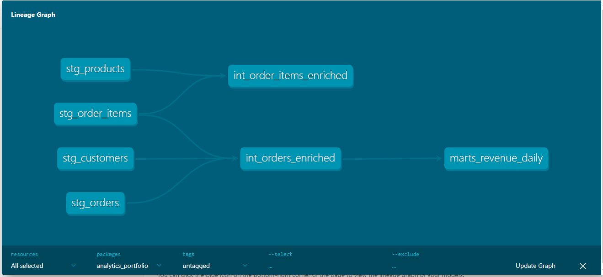
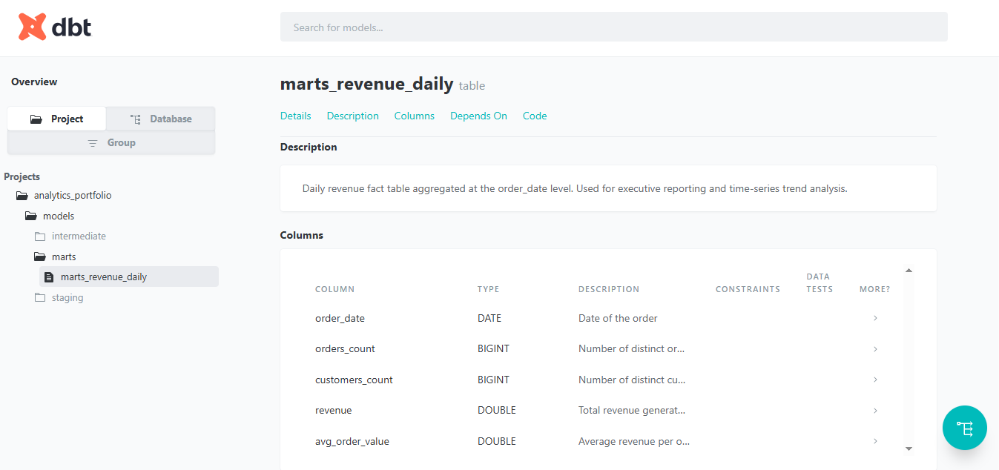

# Analytics Portfolio

This repository contains end-to-end analytics engineering work demonstrating data modeling,
metric definition, data quality validation, dashboards, and self-serve analytics.

Projects are organized using an analytics-engineer-style structure inspired by modern dbt
best practices.

---

## Tech Stack
- SQL
- dbt (DuckDB adapter)
- DuckDB
- Python (data generation)
- Git / GitHub

---

## Project Structure
- `models/staging` — Raw data cleanup and standardization  
- `models/intermediate` — Business logic and enriched datasets  
- `models/marts` — Analytics-ready fact tables  
- `portfolio_assets_dbt_docs` — dbt documentation screenshots  
- `analytics.db` — Local DuckDB database  

---

## Featured dbt Project: Daily Revenue Analytics

This project models transactional order data into an analytics-ready **daily revenue fact table**
using a layered dbt architecture:

- **Staging models** clean raw CSV inputs  
- **Intermediate models** enrich orders with customer and item context  
- **Mart model** aggregates daily revenue metrics for reporting and analysis  

---

### Key Metrics
- Orders count  
- Distinct customers  
- Total revenue  
- Average order value (AOV)  

---

## dbt Lineage & Documentation

### End-to-End Lineage (Raw → Staging → Intermediate → Marts)

### `marts_revenue_daily` Model Documentation

---

## Notes
- Models include data quality tests (e.g., `not_null`)
- Documentation generated using `dbt docs generate`
- Designed to reflect production-style analytics engineering workflows

